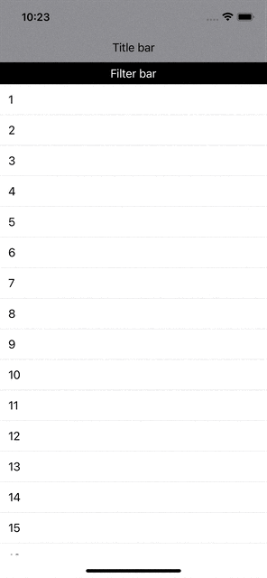

# Scroll View Coordination

Uses SwiftUI and Combine to create a scroll view with a header that hides when the user scrolls down (swipes up) and shows when the user scrolls up (swipes down). Illustrates the use of `PreferenceKey` to communicate data up the view hierarchy.

